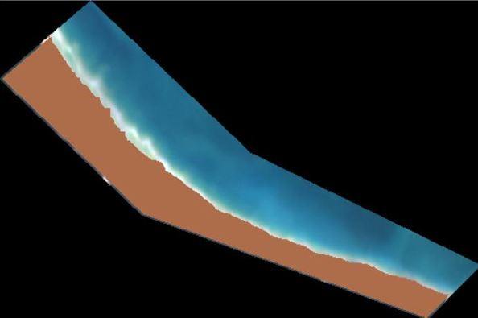
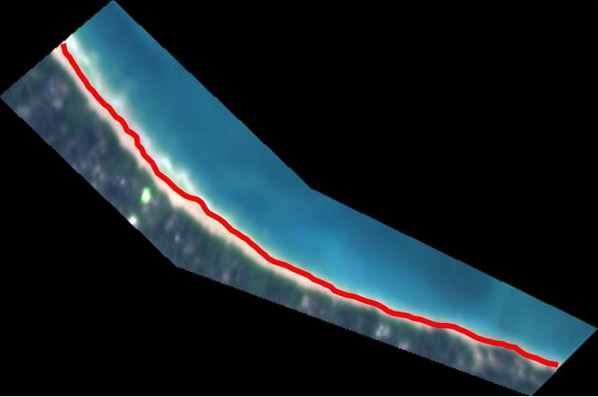
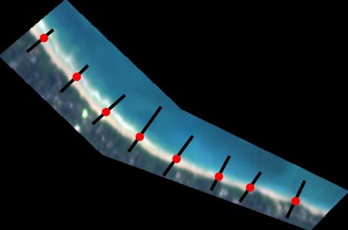

# CoastVision
[](
https://github.com/Climate-Resilience-Collaborative/CoastVision/commits/)

[](https://opensource.org/licenses/MIT)


CoastVision is an open-source Python framework geared towards generating satellite-derived shorelines (SDS) in [PlanetScope](https://developers.planet.com/docs/data/planetscope/) imagery. Given a time window and an area of interest (AOI) CoastVision will download applicable PlanetScope satellite imagery, extract shorelines, and compute transect intersections.


### Table of Contents

- [Installation](#installation)
- [PlanetScope API](#api)
- [Image Co-registration](#coreg)
- [Shoreline Extraction](#sds)
   - [Image Segmentation](#seg)
   - [Shoreline Extraction](#shoreline)
   - [Transect Intersection](#intersect)
- [Tidal Corrections](#tide)
- [QAQC](#qaqc)


## 1. Installation<a name="introduction"></a>
Use `coastvision.yml` to create conda environment. This will take a few minutes.
```
cd path/to/CoastVision
conda env create -f coastvision.yml
conda activate coastvision
```

After successfully creating the environment run through `example_notebook.ipynb` using the `coastvision` environment. This notebook provides code and explination of the following steps. Given an area of interest and a timeframe of interest you can download imagery and extract shorelines from your own site from all from this notebook.

## 2. PlanetScope API<a name="api"></a>
<a href='https://developers.planet.com/docs/data/planetscope/'>PlanetScope</a> is a satellite constilation opperated by <a href='https://www.planet.com/'>Planet Labs Inc.</a> The PlanetScope constellatuion is made up of roughtly 130 satellites, capable of imageing the entire land surface of earth with daily revisit times and 3 meter spatial resolition. The imagery has four bands red, green, blue, and near-infrared. 

Given an API key, and area of interest polygon and a timeframe applicable imagery will be downloaded from Planet. See section 1 "Download PlanetScope Imager" in `example_notebook.ipynb` for more info.


## 3. Image Co-registration<a name="coreg"></a>
Satellite images need to be accurately registered, meaning that they must align correctly with one another and with real-world coordinates. <a href="https://pypi.org/project/arosics/">AROSICS</a> and open-source Python package is used to co-register images to reduce error cause image missalignments. In the image below the right pane shows reduced image offsets after AROSICS co-registration. 


## 4. Shoreline Extraction<a name="sds"></a>
### 4.1 Image Segmentation<a name="seg"></a>
A machine learning model is used to classify each pixel in the image as either land or water. The inputs to this model are the pixel values (for the four bands R,G,B,NIR) as well as band maths such as NDWI and local standard deviation.



### 4.2 Shoreline Extraction<a name="shoreline"></a>
The Marching Squares Algorithm is used to extract the line between the water and land pixels which is used as the shoreline.



### 4.3 Transect Intersection<a name="intersect"></a>
Coastal change is often measured through a series of shore normal transects. The intersection of SDS are computed and used to measure erosion and accreation along these transects. 



In this case the intersections are saved in a dataframe of the following structure:
<table border="1">
   <tr>
      <th>Timestamp</th>
      <th>Transect Label 1</th>
      <th>Transect Label 2</th>
      <th>...</th>
      <th>Transect label n</th>
      <!-- Add more headers as needed -->
   </tr>
   <tr>
      <td>2019-03-03 20:43:11</td>
      <td>Distance along transect (m)</td>
      <td>...</td>
      <td>...</td>
      <td>...</td>
      <!-- Add more data cells as needed -->
   </tr>
   <!-- Add more rows as needed -->
</table>

The distance along transect is the distance between the start (landward end) of the transect and where the shoreline intersects it.

## 5. Tidal Corrections<a name="tide"></a>
CoastVision shoreline accuracy can be improved by correcting for horizontal shifts in shoreline position due to tidal changes. The example to the right from Cadíz, Spain shows how large horizontal changes from tidal shifts can be. Using tide level data corrections can be made to where the shoreline position would be given mean sea level removing noise added by tidal fluctuations. Ocean tide levels from either tide gauge data or numerical models can be used to correct for horizontal shifts caused by differences in water levels.


## 6. QAQC<a name="qaqc"></a>
There are many sources of error in satellite-derived shorelines from faulty image classification to image alignment to tidal and wave runup noise. While much of this noise is cancelled out by the wealth of data (PlanetScope has near-daily revisit time) it is still important to remove outliers. Median filtering is used to remove outliers that are not within the `limit` (in meters) of the median (`median - limit < x < median + limit`).