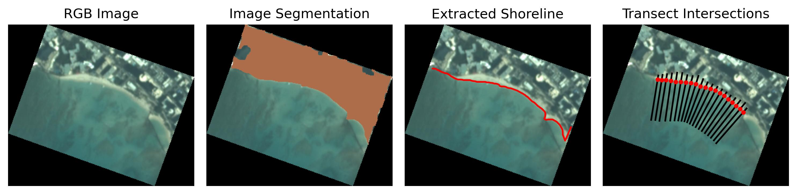
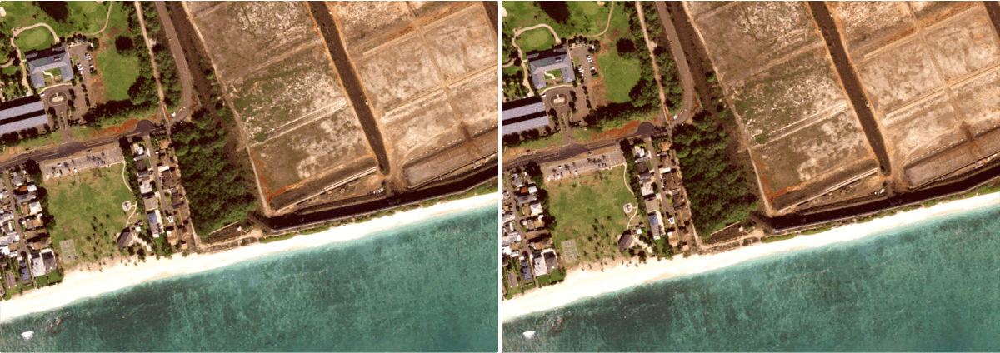

# CoastVision
[](
https://github.com/Climate-Resilience-Collaborative/CoastVision/commits/)

<!-- [](https://GitHub.com/Climate-Resilience-Collaborative/CoastVision/releases/) -->
[](https://opensource.org/licenses/MIT)


CoastVision is an open-source Python framework geared towards generating satellite-derived shorelines (SDS) in [PlanetScope](https://developers.planet.com/docs/data/planetscope/) imagery. Given a time window and an area of interest (AOI) CoastVision will download applicable PlanetScope satellite imagery, extract shorelines, and compute transect intersections.




### Table of Contents

- [Installation](#installation)
- [PlanetScope API](#api)
- [Image Co-registration](#coreg)
- [Shoreline Extraction](#sds)
   - [Image Segmentation](#seg)
   - [Shoreline Extraction](#shoreline)
   - [Transect Intersection](#intersect)


## 1. Installation<a name="introduction"></a>
Use `coastvision.yml` to create conda environment. This will take a few minutes.
```
cd path/to/CoastVision
conda env create -f coastvision.yml
conda activate coastvision
```

## 2. PlanetScope API<a name="api"></a>
<a href='https://developers.planet.com/docs/data/planetscope/'>PlanetScope</a> is a satellite constilation opperated by <a href='https://www.planet.com/'>Planet Labs Inc.</a> The PlanetScope constellatuion is made up of roughtly 130 satellites, capable of imageing the entire land surface of earth with daily revisit times and 3 meter spatial resolition. The imagery has four bands red, green, blue, and near-infrared. 

Given an API key, and area of interest polygon and a timeframe applicable imagery will be downloaded from Planet. See section 1 "Download PlanetScope Imager" in `example_notebook.ipynb` for more info.


## 3. Image Co-registration<a name="coreg"></a>
Satellite images need to be accurately registered, meaning that they must align correctly with one another and with real-world coordinates. <a href="https://pypi.org/project/arosics/">AROSICS</a> and open-source Python package is used to co-register images to reduce error cause image missalignments. In the image below the right pane shows reduced image offsets after AROSICS co-registration. 



### 4. Shoreline Extraction
####